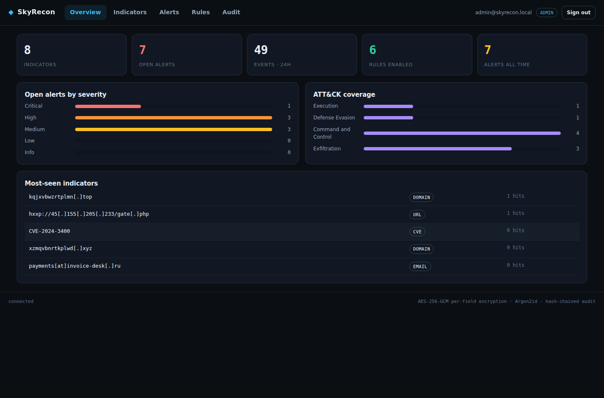
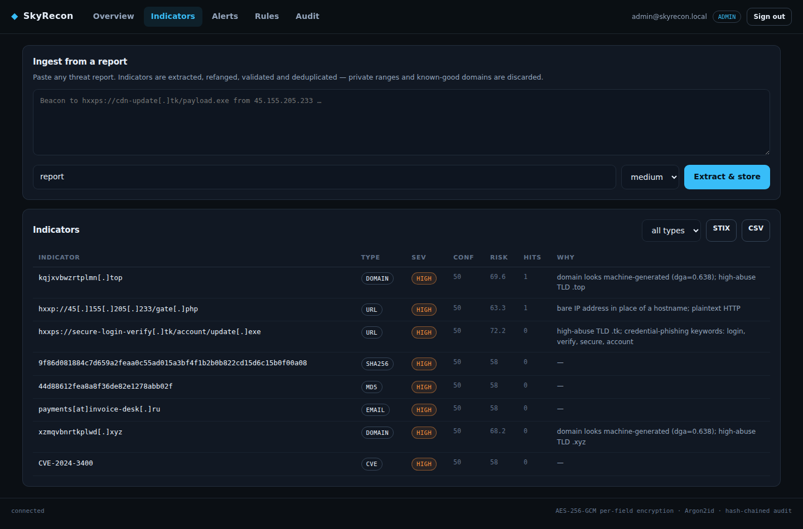
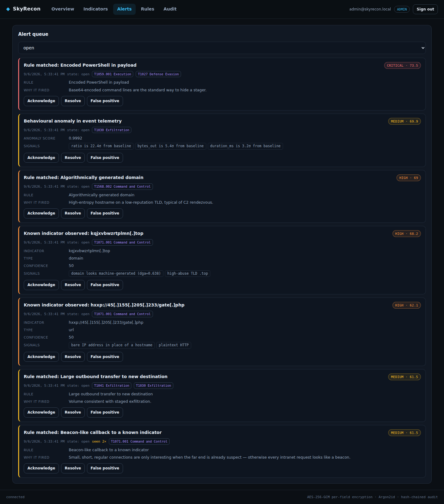

<div align="center">

# SkyRecon

**A threat intelligence and detection platform where the database is encrypted, the audit log is tamper-evident, and every detection explains itself.**

[](https://github.com/Ganatra-Ruchir/skyrecon/actions/workflows/ci.yml)
[](https://python.org)
[](https://fastapi.tiangolo.com)
[](LICENSE)
[](SECURITY.md)

</div>

---

Most "security dashboards" store their threat data in a plaintext table. SkyRecon does not. Every
indicator, event payload, alert title, analyst e-mail and MFA secret is sealed with its own
AES-256-GCM key before it touches disk, and there is a test in the suite that steals the database
files and proves none of it comes back out.

<div align="center">
  
</div>

## Two front ends

`app/static/` is the product dashboard: it authenticates and reads what the backend has
stored. `console/` is a standalone analyst workbench — one self-contained HTML file that
extracts, scores and explains a pasted report with no server at all, for a locked-down
laptop or an air-gapped review. See [console/README.md](console/README.md), including an
honest note about where its JavaScript scoring engine and `app/ioc/` could drift apart.

## What it actually does

You paste a threat report. SkyRecon pulls the indicators out of it, throws away the ones that would
poison your blocklist, scores what remains, and then watches your telemetry for them — with
detection rules you can read, and an anomaly model for the attacks nobody wrote a rule for.

**Extraction that knows what to ignore.** Refangs `hxxps://evil[.]com`, finds IPv4, domains, URLs,
MD5/SHA-1/SHA-256, e-mails and CVEs, and resolves overlaps so a URL is not also stored as three
separate indicators. Then it discards what should never be an IOC: RFC1918 and loopback, link-local,
carrier-grade NAT, documentation ranges, and a known-good domain list. *Blocking `10.0.0.0/8`
because it appeared in an incident report is a real outage, and it happens.*

**Confidence that decays.** An indicator seen once in 2023 is not the same signal as one seen this
morning. Confidence follows a 30-day half-life; a repeat sighting reinforces it, but only up to a
ceiling set by how much the source is trusted — OSINT tops out at 64, a manual analyst entry at 94.
No feed can ever assert its way to certainty.

**Enrichment that shows its work.** Shannon entropy and n-gram improbability for DGA likelihood, TLD
abuse-rate weighting, URL-shortener and bare-IP-URL detection, credential-phishing keywords. Every
adjustment carries a sentence explaining itself, and those sentences reach the analyst:
*"domain looks machine-generated (dga=0.638); high-abuse TLD .top"*.

**Detection rules that are parsed, never evaluated.** A small expression language —
`dga > 0.6 and tld_risk > 0.5`, `payload matches "-e(nc|ncodedcommand)?\s"` — with a
hand-written recursive-descent parser. There is no `eval`, no `exec`, and no path from a rule string
to code execution. Six rules ship enabled; you can add your own from the dashboard and test them
against a sample event before saving.

**An anomaly model for what the rules miss.** Isolation Forest when scikit-learn is installed, a
pure-Python z-score baseline when it is not, over six features of every event. In the seeded demo it
is the *only* thing that catches the 41 MB outbound transfer — no rule in the pack describes it:

```
41 MB outbound — nothing in the rule pack describes this
  risk=69.9   matched=0 alerts=2 anomaly=0.9992
    · ratio is 22.4σ from baseline
    · bytes_out is 5.4σ from baseline
    · duration_ms is 3.2σ from baseline
```

**MITRE ATT&CK mapping and real export formats.** Alerts carry technique IDs, the overview shows
kill-chain coverage, and indicators export as STIX 2.1 bundles, MISP events, or CSV.

| | |
|---|---|
|  |  |
| Ingest a report, watch what gets stored and what gets rejected | Every alert says which rule fired and why |

## Security

This is the part the project is actually about. [SECURITY.md](SECURITY.md) has the threat model;
the short version:

| | |
|---|---|
| **Encryption at rest** | Envelope encryption. Every sensitive field gets its own AES-256-GCM data key, wrapped under a key derived from a master key that lives in the environment and never in the database. |
| **Field binding** | Each ciphertext carries AAD of `table \| column \| row-id`, so a stolen blob cannot be replayed into a different field or a different record. |
| **Searchable without decrypting** | Blind indexes: a keyed SHA-256 that supports equality lookup and nothing else. No ordering, no prefix search, no reversal. |
| **Key rotation** | Rewraps every sealed field and rebuilds every blind index, in one transaction that rolls back on any failure. `POST /api/admin/keys/rotate` is dry-run by default, and a test fails the build if a new encrypted column is missing from the rotation plan. |
| **Passwords** | Argon2id (t=3, 64 MiB, p=2) with a policy that rejects short, common, low-entropy passwords and anything containing the user's own e-mail. |
| **Sessions** | Short-lived JWT access tokens plus rotating opaque refresh tokens. Replaying a used refresh token revokes the entire token family — the standard signal that a token was stolen. |
| **MFA** | TOTP, enforced for admins by default. Enrolment returns a provisioning URI; the secret is sealed like every other field. |
| **Brute force** | Per-identity token-bucket rate limiting, plus account lockout after 5 failed logins for 15 minutes. |
| **Audit** | Hash-chained. Every entry commits to the one before it, so editing or deleting history is detectable — `GET /api/admin/audit/verify` or `python -m app.cli verify-audit`. |
| **Headers** | Strict CSP with no inline scripts, HSTS in production, `frame-ancestors 'none'`, `no-store`, and the server banner stripped. |
| **Supply chain** | Every dependency pinned; `pip-audit`, `bandit` and `ruff` run in CI, and the audit re-runs weekly so a pin cannot quietly rot into a known CVE. |

### Proving it, rather than claiming it

`tests/test_at_rest.py` drives real data through the API, then reads the raw bytes of
`test.db`, `test.db-wal` and `test.db-shm` — what an attacker walks away with — and asserts that
none of the indicators, payloads, e-mails, passwords or triage notes appear anywhere in them.

That test exists because an earlier version of this code *failed* it. The indicator column was
encrypted correctly, and then the alert title said `Known indicator observed: kqjxvbwzrtplmn[.]top`
and wrote it straight back to disk in the clear. Encrypting the obvious column is not the same as
protecting the data.

```
  recoverable from the stolen files?
    DGA domain 'kqjxvbwzrtplmn'        no
    C2 IP '45.155.205.233'             no
    operator mail 'invoice-desk'       no
    admin e-mail 'skyrecon.local'      no
    event payload 'EncodedCommand'     no
    bootstrap password                 no
    alert title 'Known indicator'      no

  verdict: no plaintext recoverable
```

## Quick start

```bash
git clone https://github.com/Ganatra-Ruchir/skyrecon.git
cd skyrecon

python -m venv .venv && source .venv/bin/activate   # Windows: .venv\Scripts\activate
pip install -r requirements.txt

uvicorn app.main:app --reload --no-server-header
```

Open <http://127.0.0.1:8000>. In development, keys are generated on the fly and the first-run
administrator's password is printed to the console once. Interactive API docs are at `/docs`.

To see it with data in it:

```bash
uvicorn app.main:app --port 8099 &   # in one shell
python seed.py                        # in another
```

`seed.py` ingests a synthetic incident report, replays two weeks of routine traffic so the anomaly
model has a baseline, then fires the incident and prints what each stage detected. Everything in it
is fabricated — no real host is contacted.

## Deploying it

Production refuses to start without real secrets. That is deliberate: a "temporary" development
key on a public instance is how encrypted data becomes decrypted data.

```bash
python -m app.cli genkeys        # prints a master key and a JWT secret
```

> **Back the master key up before you use it.** It is not stored in the database, and there is no
> recovery path. Losing it means the encrypted rows stay encrypted forever.

**Docker** — one container, SQLite on a volume, nothing else to operate:

```bash
cp .env.example .env             # paste the generated keys in
docker compose up --build        # → http://localhost:8000
```

The image runs as a non-root user on a read-only filesystem with all capabilities dropped. Add
`--profile postgres` for PostgreSQL, or `--build-arg WITH_ML=1` for the Isolation Forest extra.

**Render** — [`render.yaml`](render.yaml) is a complete blueprint: point Render at the repo, and it
builds the Dockerfile, attaches a disk and generates both secrets on first deploy.

**Fly.io** — [`fly.toml`](fly.toml) with a mounted volume.

**Railway / Heroku-style** — [`Procfile`](Procfile).

<details>
<summary><strong>Configuration</strong></summary>

| Variable | Default | Notes |
|---|---|---|
| `SKYRECON_ENV` | `development` | `production` enforces real secrets and hides `/docs` |
| `SKYRECON_MASTER_KEY` | *(generated in dev)* | 32-byte base64. Back it up. |
| `SKYRECON_JWT_SECRET` | *(generated in dev)* | Min 32 characters in production |
| `SKYRECON_DATABASE_URL` | `sqlite:///./skyrecon.db` | Or `postgresql+psycopg://…` |
| `SKYRECON_CORS_ORIGINS` | `http://localhost:8000` | Comma-separated |
| `SKYRECON_ACCESS_TTL_MIN` | `15` | Access token lifetime |
| `SKYRECON_REFRESH_TTL_DAYS` | `7` | Refresh token lifetime |
| `SKYRECON_RATE_LIMIT` / `_WINDOW` | `120` / `60` | Requests per window, per identity |
| `SKYRECON_REQUIRE_ADMIN_MFA` | `true` | TOTP mandatory for admins |
| `SKYRECON_IOC_HALF_LIFE_DAYS` | `30` | Confidence decay |

</details>

## API

Everything the dashboard does is a public API call. Full interactive reference at `/docs` in
development.

<details>
<summary><strong>Endpoints</strong></summary>

**Auth** — `POST /api/auth/login` · `/refresh` · `/logout` · `/password` · `/mfa/enroll` ·
`/mfa/confirm` · `GET /api/auth/me`

**Intelligence** — `POST /api/indicators` · `GET /api/indicators` · `GET /api/indicators/{id}` ·
`DELETE /api/indicators/{id}` · `POST /api/indicators/bulk` ·
`GET /api/indicators/export/{stix|misp|csv}`

**Telemetry & detection** — `POST /api/events` · `GET /api/events` · `GET /api/alerts` ·
`POST /api/alerts/{id}/triage` · `GET /api/rules` · `POST /api/rules` · `POST /api/rules/test` ·
`DELETE /api/rules/{id}` · `GET /api/stats`

**Administration** — `GET/POST /api/admin/users` · `POST /api/admin/users/{id}/role` ·
`/disable` · `GET /api/admin/audit` · `/audit/verify` · `POST /api/admin/keys/rotate`

**System** — `GET /api/health`

</details>

<details>
<summary><strong>Roles</strong></summary>

| | Viewer | Analyst | Admin |
|---|:--:|:--:|:--:|
| Read indicators, events, alerts, rules | ✅ | ✅ | ✅ |
| Add indicators, ingest events, triage alerts | | ✅ | ✅ |
| Write and delete detection rules | | | ✅ |
| Manage users, read audit, rotate keys | | | ✅ |

</details>

<details>
<summary><strong>Rule expression language</strong></summary>

Fields: `severity`, `confidence`, `bytes_out`, `bytes_in`, `duration_ms`, `ioc_type`, `dga`,
`tld_risk`, `entropy`, `payload`, `source`.

Operators: `and` `or` `not` `( )` · `== != > < >= <=` · `contains` · `matches` (regex) · `in`.

```
dga > 0.6 and tld_risk > 0.5
payload contains "powershell" and payload matches "-e(nc|ncodedcommand)?\s"
ioc_type == "url" and (payload contains "login" or payload contains "verify") and tld_risk > 0.5
```

`POST /api/rules/test` evaluates an expression against a sample event without saving it. Invalid
expressions are rejected at write time, and a rule that throws at match time is skipped rather than
allowed to break ingestion.

</details>

## How it is built

```
app/
├─ main.py            application, bootstrap, error handling
├─ config.py          settings; production refuses to start without secrets
├─ models.py          SQLModel tables — sealed columns are named *_sealed
├─ services.py        ingest, scoring, alerting, dedupe
├─ audit.py           hash-chained audit log
├─ security/
│  ├─ crypto.py       envelope encryption, AAD binding, blind indexes
│  ├─ rotation.py     the declared set of everything a key rotation must touch
│  ├─ passwords.py    Argon2id + password policy
│  ├─ tokens.py       JWT access, rotating refresh tokens
│  ├─ mfa.py          TOTP
│  ├─ rbac.py         roles → explicit permissions
│  ├─ ratelimit.py    token bucket
│  └─ headers.py      CSP, HSTS, and friends
├─ ioc/               parse · normalise · score · enrich · STIX/MISP export
├─ detect/            rule parser · anomaly model · ATT&CK mapping
├─ routers/           auth · intel · admin
└─ static/            the dashboard — no framework, no build step, CSP-clean
```

About 3,700 lines of application Python, 600 of front-end and 800 of tests — 60 of them. Design decisions and the
reasoning behind them are in [docs/ARCHITECTURE.md](docs/ARCHITECTURE.md).

## Development

```bash
pip install -r requirements-dev.txt

pytest tests/ -q                              # 60 tests
ruff check .                                  # lint
bandit -c pyproject.toml -r app seed.py       # static security scan
pip-audit -r requirements.txt --strict        # dependency CVEs
python -m app.cli verify-audit                # audit chain integrity
```

CI runs all of the above on Python 3.12 and 3.13, verifies the core install still works without
numpy or scikit-learn on 3.11, builds the container and boots it until `/api/health` answers.

## Honest limitations

- **Single writer.** The rate limiter and anomaly model hold per-process state. Scale with replicas
  behind a load balancer, and move the limiter to Redis first — it is one method behind an
  interface.
- **Blind indexes support equality only.** By design. If you need `LIKE '%value%'` over encrypted
  columns, this is not the schema for it.
- **No live feed connectors.** Ingest is API and paste-a-report. Feed pollers are the obvious next
  addition and would slot in behind `services.bulk_ingest`.
- **The anomaly model is a ranking aid, not a verdict.** It says "unlike the baseline". A rule or an
  analyst still has to say "malicious".

## License

MIT — see [LICENSE](LICENSE).

<div align="center">
<sub>Built by <a href="https://github.com/Ranchiro">Ruchir Ganatra</a> · <a href="https://linkedin.com/in/ruchir-ganatra">LinkedIn</a></sub>
</div>
